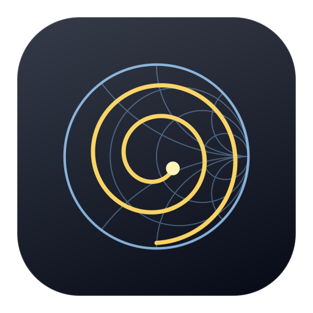

# MightyVNA

A native macOS companion app for NanoVNA-class vector network analysers, written in Swift and SwiftUI.

Most NanoVNA software is Windows-first, or a Python/Qt port that feels foreign on a Mac. MightyVNA is
built for macOS: a real AppKit/SwiftUI app, no Python runtime, no Wine, no Rosetta.



---

## Supported hardware

MightyVNA speaks all three protocols used across these instruments and auto-detects which one a device uses.

| Device | Protocol | Range | Notes |
|---|---|---|---|
| NanoVNA (original, ttrftech) | ASCII shell | 50 kHz – 900 MHz | harmonics above 300 MHz |
| NanoVNA-H | ASCII shell | 10 kHz – 1.5 GHz | DiSlord firmware, up to 401 points |
| NanoVNA-H4 | ASCII shell | 10 kHz – 1.5 GHz | 480×320 screen capture |
| NanoVNA-F (SYSJOINT) | ASCII shell | 10 kHz – 1.5 GHz | 4.3″ metal-cased unit |
| **NanoVNA-F V2 (SYSJOINT)** | ASCII shell | 50 kHz – 3 GHz | the unit this app was designed around |
| NanoVNA-F V3 | ASCII shell | 50 kHz – 6 GHz | |
| DeepVNA 101 | ASCII shell | 10 kHz – 1.5 GHz | H4 derivative |
| NanoVNA V2 / S-A-A-2 | V2 binary | 50 kHz – 3 GHz | register protocol, no text shell |
| NanoVNA V2 Plus | V2 binary | 50 kHz – 3 GHz | |
| NanoVNA V2 Plus4 | V2 binary | 50 kHz – 4.4 GHz | |
| SAA-2N | V2 binary | 50 kHz – 3 GHz | |
| LiteVNA 62 / 64 | V2 binary | 50 kHz – 6.3 GHz | |
| SV4401A / SV6301A | V2 binary | 50 kHz – 4.4 / 6.3 GHz | |
| **LibreVNA** | LibreVNA packets | 100 kHz – 6 GHz | **full two-port**: real S11, S21, S12 and S22 |

Every NanoVNA-family device is a one-port-plus-response instrument: it measures the forward
direction only. The **LibreVNA is a true two-port analyser**, so MightyVNA measures all four
S-parameters from it and can run a full 12-term two-port calibration. The app adapts to whichever
is connected — channel pickers, calibration steps, exports and readouts all change accordingly.

The LibreVNA is not a serial device: it exposes vendor-specific USB bulk endpoints, so MightyVNA
talks to it directly over IOKit with no serial driver, no libusb and no kext.

Unrecognised devices still work: they fall back to a conservative generic profile, and the driver
**learns the real limits at runtime** — if the firmware returns fewer points than requested, MightyVNA
records that limit and segments longer sweeps automatically.

There are two **built-in simulators**, so every feature works with nothing plugged in:

| Simulator | Launch flag | What it models |
|---|---|---|
| NanoVNA | `--simulator` | one-port-plus-response: a dual-band antenna on CH0, a 300 MHz bandpass filter on CH1 |
| LibreVNA | `--librevna-simulator` | a full two-port 300 MHz bandpass filter, measured in both directions, driven through the real LibreVNA packet protocol over an in-process loopback |

The LibreVNA simulator is not a shortcut around the protocol: it encodes and decodes genuine
LibreVNA packets, so the driver, the S12/S22 plumbing and the 12-term calibration are all exercised
end to end.

---

## Building

Requires macOS 14 or later and Xcode 15+ (tested with Xcode 26.2 / Swift 6.2).

```bash
./Scripts/build_app.sh            # release build → build/MightyVNA.app
open build/MightyVNA.app
```

Other entry points:

```bash
swift build                       # library + executable
swift test                        # 90 unit tests over the DSP, calibration, protocols and file formats
swift Scripts/make_icon.swift     # regenerate Resources/AppIcon.icns
./Scripts/build_app.sh debug      # faster, unoptimised build
```

The package also opens directly in Xcode (`File ▸ Open` on the folder).

---

## Features

**Acquisition**
- Continuous or single sweeps, start/stop or centre/span entry, engineering-notation input (`144M`, `2.4 GHz`)
- 51–1001 points, automatically split into hardware-sized segments when the device cannot do them in one pass
- Averaging: sliding average, exponential, min-hold, max-hold
- One-click band presets: every amateur band from 630 m to 13 cm, plus broadcast, airband, marine, ISM, GSM, GPS and Wi-Fi
- Option-drag on any plot to zoom the sweep to that span

**Display**
- 1, 2, 4 or 6 plot panes; each pane is rectangular, Smith, polar or time-domain
- 30+ trace formats: log/lin magnitude, phase, unwrapped phase, group delay, SWR, return loss, mismatch loss,
  reflected power, real/imaginary, R, X, |Z|, ∠Z, G, B, |Y|, series and parallel L/C, Q, shunt- and
  series-through impedance, Smith (impedance and admittance), polar, and four TDR formats
- Per-trace scale, reference level and reference line position; auto-scale per trace or globally
- Smoothing, electrical delay (with an automatic phase-slope fit) and cable-loss compensation per trace
- Memory traces with live ÷ memory and live − memory maths
- Limit lines with live PASS/FAIL and worst-case margin
- Linear or logarithmic frequency axis, hover crosshair readout, marker readout strips

**Markers**
- Up to 8 markers, drag anywhere on any chart
- Tracking modes: maximum, minimum, leftmost/rightmost peak, −3 dB points, and reactance-zero resonance
- Delta markers, per-marker trace binding, full impedance readout (Z, |Z|, equivalent L or C, Q, SWR, return loss)

**Calibration**
- Host-side SOLT computed on the Mac, leaving the instrument's own calibration untouched
- Adapts to the hardware: one-port, one-port + forward response, or a **full 12-term two-port**
  calibration when the instrument measures the reverse direction
- Open, short, load on port 1; the same three on port 2 for two-port devices; plus isolation and through
- Full cal-kit model: offset delay, offset loss, open fringing capacitance C0–C3, short inductance L0–L3, load R and L
- Built-in kits (ideal, typical NanoVNA SMA, 3.5 mm precision) plus a coefficient editor for your own
- Residual-directivity readout so you can see how good the calibration actually is
- Calibration interpolates onto any sweep grid, so you can zoom in without recalibrating
- Save/load calibrations; on-device calibration passthrough for the instrument's own SOLT and memory slots

**Time domain / TDR**
- Lowpass step, lowpass impulse and bandpass impulse modes
- Rectangular, Hann, Hamming, Blackman, Blackman-Harris and Kaiser windows
- DC extrapolation for sweeps that do not start at DC, configurable zero padding
- Distance-to-fault, resolution and unambiguous-range readouts, impedance-versus-distance trace

**Analysis tools**
- Antenna: resonance, minimum SWR, feedpoint impedance, SWR bandwidth, loaded Q, tuning advice
- Filter: insertion loss, −3/−6/−60 dB bandwidths, shape factor, passband ripple, stopband rejection
- Matching: every two-element L-network that matches the measured load, with component values, loaded Q,
  bandwidth estimate and residual SWR — plus quarter-wave transformer impedance and length
- Cable: velocity-factor solving from a known length, distance to fault, measured and catalogue loss,
  16 common cable types

**Data**
- Touchstone `.s1p` / `.s2p` import and export (RI, MA and dB/angle, any frequency unit), with real
  S12 and S22 written when the instrument measured them
- CSV export with derived quantities, clipboard copy, scrollable data table
- Session documents (`.mightyvna`) holding traces, markers, calibration, memories and the live sweep
- Plot export as PNG
- Instrument screen capture with automatic resolution detection, saved as PNG

**Instrument access**
- Serial console with command history and a suggestion list for the text shell
- Live traffic log of everything sent and received
- Battery voltage, firmware banner, detected command set

---

## Architecture

```
Sources/
  VNACore/            no UI — testable, usable from other tools
    Model/            Complex, RF maths, traces, markers, calibration, cal kits,
                      Touchstone, workspace and session documents, analysis tools
    DSP/              radix-2 FFT, window functions, time-domain transform
    Serial/           POSIX termios port, IOKit port enumeration, IOUSBLib bulk transport
    Device/           driver protocol, ASCII shell driver, V2 binary driver,
                      LibreVNA packet codec + driver, synthetic DUTs, simulators,
                      session (threading + sweep segmentation)
  MightyVNA/          SwiftUI application
    App/              app entry, AppModel, menu commands, document I/O, theme
    Views/            charts (rectangular, Smith, polar), panels, tools
Tests/VNACoreTests/   90 tests
```

Serial I/O is blocking POSIX code on a dedicated `DispatchQueue`, bridged to `async/await` by
`SerialWorker`. Nothing touching the port ever runs on the main thread; nothing touching the UI ever
runs off it.

---

## Protocol notes

**ASCII shell.** Commands are terminated with CRLF; the device echoes the command, prints its output,
then a `ch> ` prompt. MightyVNA first tries the fast path — `scan <start> <stop> <points> 7`, which
returns frequency, S11 and S21 for every point in one command — and falls back to the universal
`sweep` / `frequencies` / `data 0` / `data 1` sequence if the firmware does not support the output mask.
Screen captures are raw big-endian RGB565; the resolution is inferred from the byte count, so it works
on 320×240, 480×272, 480×320 and 800×480 devices without being told which one it is.

**V2 binary.** A flat register file: sweep start (8 bytes at `0x00`), step (`0x10`), points (`0x20`) and
values-per-frequency (`0x22`) are written, then the 32-byte-per-point FIFO at `0x30` is drained.
Each record carries the forward reference and both received channels as little-endian `int32` pairs,
so S11 = rev0/fwd0 and S21 = rev1/fwd0.

**LibreVNA.** Length-prefixed packets — `[0x5A][uint16 length][uint8 type][payload][uint32 CRC32]` —
over bulk endpoints `0x01` (out) and `0x81` (in) on USB interface 0. A sweep is configured with one
31-byte `SweepSettings` packet, after which the device streams a datapoint packet per frequency.
Each datapoint carries every receiver reading it took, tagged with the excitation stage, the receiver
it came from and whether it is a reference channel, so S(i,j) = receiver_i / reference_j. Datapoint
packets carry a zero CRC by design: the firmware skips the calculation because it dominates the
per-point transmit cost.

See [Docs/PROTOCOLS.md](Docs/PROTOCOLS.md) for the full command, register and packet reference.

## Honest limitations

- **Every NanoVNA measures forward only.** There is no S22 or S12 from that hardware. Exported `.s2p`
  files from a NanoVNA write S12 as a copy of S21 (reciprocity assumed) and S22 as zero, with a comment
  in the file saying so. On a LibreVNA all four parameters are real measurements and are written as such.
- **Calibration accuracy follows the hardware.** A NanoVNA gets a one-port correction on S11 plus a
  response correction on S21; the "enhanced response" mode estimates port-2 match from the through, which
  helps with mismatched DUTs but is not a two-port calibration. A LibreVNA gets the real thing: twelve
  error terms solved from standards on both ports plus a through, verified in the test suite to recover a
  known non-reciprocal DUT to 1e-7.
- **The V2 binary and LibreVNA drivers have not been run against physical hardware.** They were written
  against the published register map and the LibreVNA firmware's own `Protocol.hpp`, and are covered by
  unit tests — including a loopback that speaks real LibreVNA packets — but no V2 or LibreVNA hardware
  was available while building them. The ASCII path is the one to trust first on an F V2. If a device
  misbehaves, the console tab shows every byte exchanged.
- Device-variant → model mapping for V2 devices is best-effort; unknown variants fall back to a generic
  3 GHz profile, and you can override the protocol choice in the sidebar.
- Frequency limits and screen sizes in the device catalogue are nominal. The app prefers what it learns
  from the hardware — point count, capture resolution, and on a LibreVNA the full limits reported in its
  device-info packet — over the catalogue entry.
- The built-in 3.5 mm cal-kit coefficients are approximations of a Keysight-style kit. For accurate work
  above a few hundred MHz, enter the values from your own kit's data sheet in the kit editor.

## Licence

GPL-3.0. See [LICENSE](LICENSE).

This matches the licensing of the wider NanoVNA software ecosystem (NanoVNA-App, NanoVNA-QT and the
LibreVNA project itself are all GPL), so protocol work can flow back and forth between them.
